<!-- _class: title-slide -->

# Week 3
## Beslissingsbomen & Ensemble Learning

---

<!-- _class: red-bg -->
## Herhalen

---

## Vorige week: SVM

- SVM zoekt de **grootst mogelijke marge**; de parameter $C$ stuurt de afweging tussen marge en fouten
- **Kernels** (kernel trick) maken niet-lineaire data lineair separabel in een hogere dimensie
- Evaluatie via confusion matrix, precision/recall/F1 en cross-validatie

> 📌 Vandaag bekijken we een model dat **heel intuïtief is** (beslissingsboom), maar last heeft van **toeval en overfitting**. De oplossing? **Ensemble learning!**

---

<!-- _class: red-bg -->
# Beslissingsbomen

---

## Beslissingsbomen

- Werken voor zowel **classificatie** als **regressie**
- Ook bruikbaar voor **multilabel-problemen**
- **'White box' model:** zeer leesbaar en begrijpelijk voor mensen
- Classificatie is dankzij de boomstructuur **erg snel**

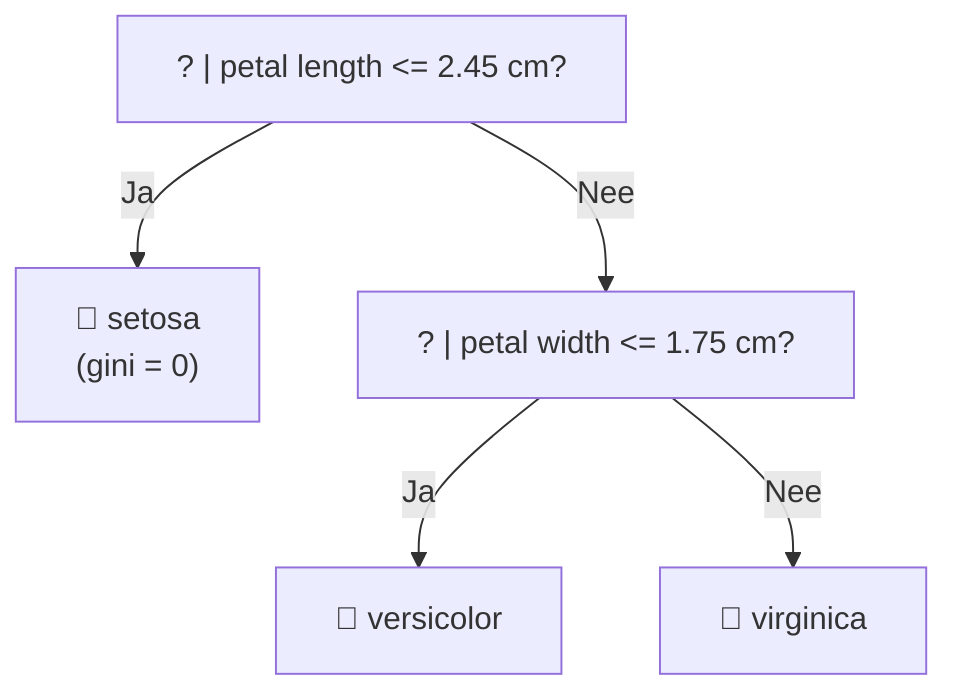

---

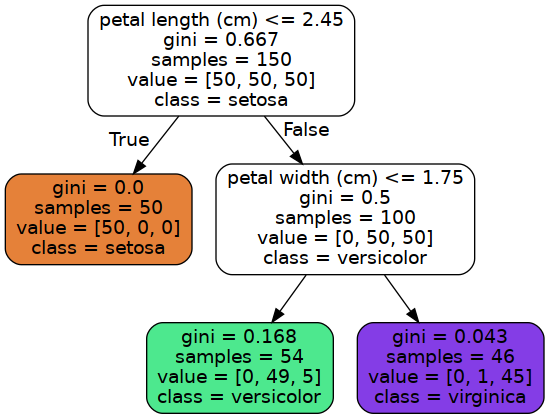

- Elk **intern knooppunt** test één feature tegen een drempelwaarde (bv. `petal width (cm) <= 0.8`)
- De **bladeren** bevatten de voorspelde klasse (+ verdeling over klasses)

---

## Decision boundary

- De dataruimte wordt opgedeeld in **rechthoekige zones** (per split wordt slechts 1 feature gesplitst)
- Bij SVM is dit niet per se het geval: daar kunnen de scheidingslijnen **schuin** lopen
- Dit is intuïtief makkelijk te begrijpen ✅

---

## Decision boundary

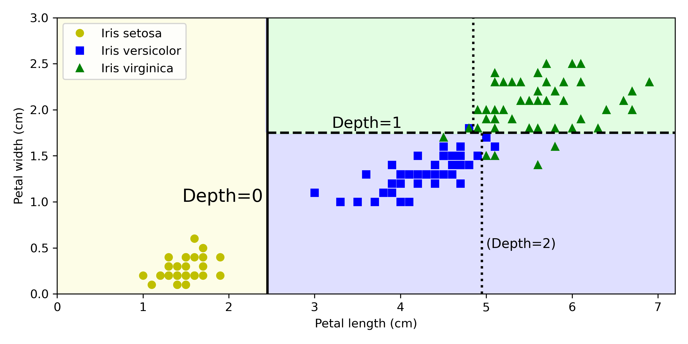

---

## Hoe wordt de boom opgebouwd? Gini impurity

- Bij elke stap kiest de boom het criterium dat het **'meest onderscheidend'** is
- Dit wordt berekend met de **Gini impurity** — die willen we **laag** houden:

$$ G_i = 1 - \sum_{k=1}^{n} p_{i,k}^2 $$

- $p_{i,k}$ = fractie van de trainingsitems in node $i$ die tot klasse $k$ behoren
- $G_i = 0$ betekent een **volledig zuivere** node (alle items van dezelfde klasse)

---

## Gini impurity — rekenvoorbeeld

Voor de depth-2 node links in de iris-boom (54 items: 0 setosa, 49 versicolor, 5 virginica):

$$ G_i = 1 - \left(\frac{0}{54}\right)^2 - \left(\frac{49}{54}\right)^2 - \left(\frac{5}{54}\right)^2 \approx 0.168 $$

```python
# idem in code:
1 - (0/54)**2 - (49/54)**2 - (5/54)**2   # = 0.168
```

---

## CART: kostfunctie

- De boom wordt opgebouwd met het **CART**-algoritme (*Classification and Regression Tree*)
- CART zoekt per split de beste combinatie van feature $k$ en drempelwaarde $t_k$, zodanig dat de **kostfunctie minimaal** is:

$$ J(k, t_k) = \frac{m_{\text{left}}}{m}G_{\text{left}} + \frac{m_{\text{right}}}{m}G_{\text{right}} $$

- $G_{\text{left}}$ / $G_{\text{right}}$: Gini impurity van de linker/rechter subset
- $m_{\text{left}}$ / $m_{\text{right}}$: aantal items in die subset; $m$ = totaal

> ⚠️ CART is **greedy**: het kiest telkens het beste *op dat moment*, niet de globaal optimale boom. Het resultaat is dus 'redelijk goed', maar niet per se optimaal!

---

## Nadelen van beslissingsbomen

- Erg **onderhevig aan toeval** in de dataset (kleine wijzigingen → hele andere boom)
- **Groot risico op overfitting** → regularisatie is nodig!

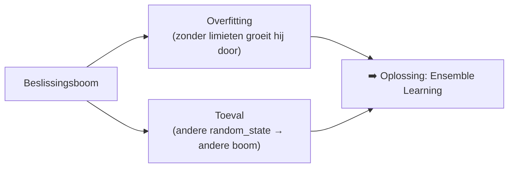

---

## Regularisatie van een decision tree

Een decision tree is een **non-parametric model**: zonder limieten fit hij de data altijd (volledig). Beperk dit met regularisatieparameters:

| Parameter | Betekenis |
|---|---|
| `max_depth` | minder diep = minder risico op overfitting |
| `min_samples_split` | minimum aantal samples om een split te doen |
| `min_samples_leaf` | minimum aantal items per leaf |
| `max_leaf_nodes` | totaal maximum op aantal leaves |
| `max_features` | maximum aantal features per split |

---

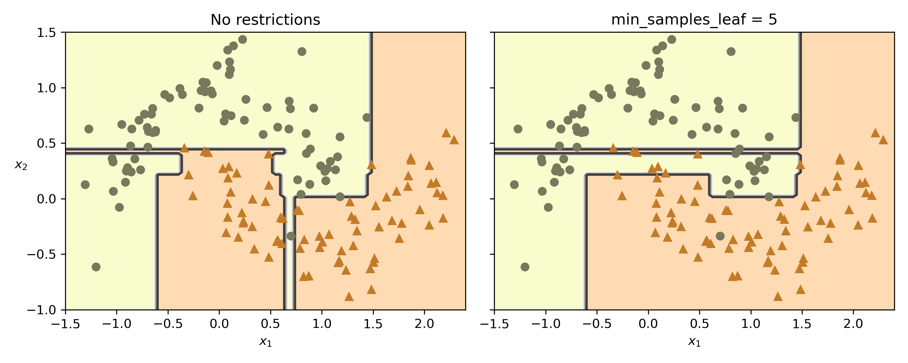

> Links: geen beperkingen (overfit). Rechts: `min_weight_fraction_leaf = 0.025` → veralgemeend beter ✅

---

## Decision Tree in sklearn

```python
from sklearn.tree import DecisionTreeClassifier
from sklearn.model_selection import train_test_split

X_train, X_test, y_train, y_test = train_test_split(
    iris.data, iris.target, random_state=42)

tree_clf = DecisionTreeClassifier(
    max_depth=2,            # regularisatie: beperkt diepte van de boom
    min_samples_leaf=5,     # regularisatie: minimum items per leaf
    random_state=42
)
tree_clf.fit(X_train, y_train)

from sklearn.metrics import accuracy_score
print(accuracy_score(y_test, tree_clf.predict(X_test)))

# Boom visualiseren:
from sklearn.tree import export_graphviz
export_graphviz(tree_clf, out_file="iris_tree.dot",
                feature_names=iris.feature_names,
                class_names=iris.target_names,
                rounded=True, filled=True)
```


---
<!-- _class: interest-slide -->

## Beslissingsbomen — historische noot

- **Quinlan — ID3 (1986)** — *Induction of Decision Trees*: de eerste populaire beslissingsboom-variant, exclusief voor classificatie
  - 📄 Quinlan (1986), *Induction of Decision Trees*, Machine Learning 1:81–106 — [doi.org/10.1007/BF00116251](https://doi.org/10.1007/BF00116251)
- **Breiman, Friedman, Olshen & Stone — CART (1984)** — *Classification and Regression Trees*: het algoritme dat we vandaag in sklearn gebruiken (Gini impurity)
  - 📄 Breiman et al. (1984), *Classification and Regression Trees*, Wadsworth — [doi.org/10.1201/9781315139470](https://doi.org/10.1201/9781315139470)
- **Quinlan — C4.5 (1993)** — opvolger van ID3, ondersteunt nu ook regressie en continue attributen
  - 📄 Quinlan (1993), *C4.5: Programs for Machine Learning*, Morgan Kaufmann — [https://dl.acm.org/doi/10.5555/583200](https://dl.acm.org/doi/10.5555/583200)

---

<!-- _class: red-bg -->
# Ensemble Learning

---
<!-- _class: interest-slide -->
## Wisdom of the crowd

- Hoe oud denken jullie dat ik ben?
- 

---
## Wisdom of the crowd

- Individuele schattingen zijn fout, maar het **gemiddelde** van veel schattingen zit verrassend dicht bij de waarde

- Precies hetzelfde idee met modellen: **ensemble learning**
- Het is zelfs de bedoeling dat de ensemble classifier **beter** is dan de beste van haar componenten!

---

## Technieken om ensemble learning te doen

| Techniek | Idee |
|---|---|
| **Bagging** | zelfde modeltype, willekeurige (trainings)data per model, **met teruglegging** |
| **Pasting** | idem, maar **zonder teruglegging** (geen dubbels) |
| **Boosting** | modellen sequentieel trainen, elk model verbetert de vorige |
| **Stacking** | een meta-model ('blender') leert de outputs van andere modellen combineren |

---

## Bagging

- Meerdere classifiers, meestal van **dezelfde soort**
- Variatie in **welke training data** we aan elke classifier geven (met teruglegging → dubbels mogelijk)
- Elk model reageert dus een **beetje anders**
- Op het einde: **majority vote** (classificatie) of gemiddelde (regressie)

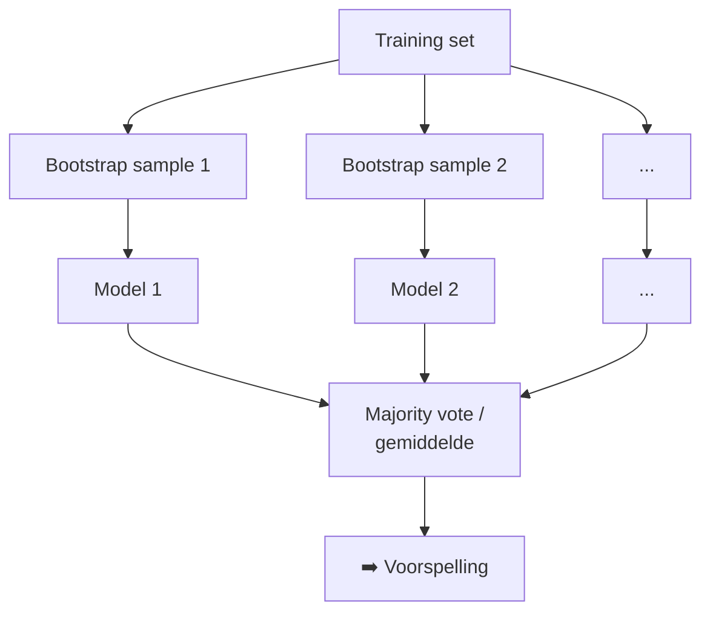

---
## Bagging

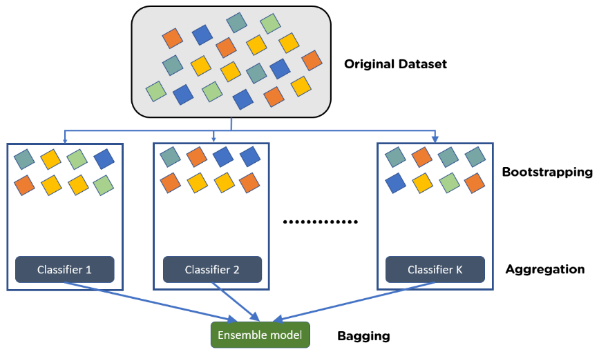

---

## Bagging → minder overfitting

- De oplossing is minder gevoelig voor overfitting, zoals hier rechts
- **Hoe evalueren we dit model correct?** → Out-of-Bag evaluatie (volgende slide)

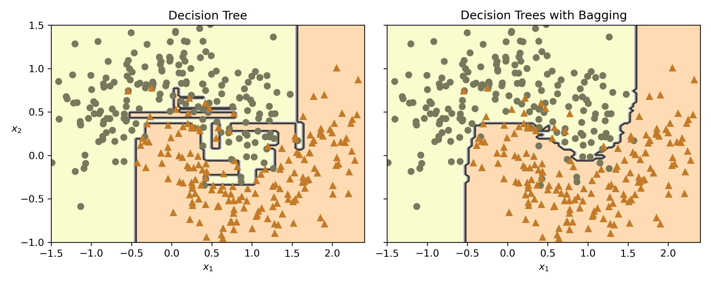

---

## Out-of-Bag (OOB) evaluatie

- Bagging samplet **met teruglegging**: per boom wordt typisch slechts **~63%** van de trainingsitems geselecteerd
- De items die **niet** geselecteerd zijn, noemen we **out-of-bag (oob)** instances
- Deze oob-items kunnen gebruikt worden om de bijhorende classifier te **evalueren** → geen aparte validatieset nodig!

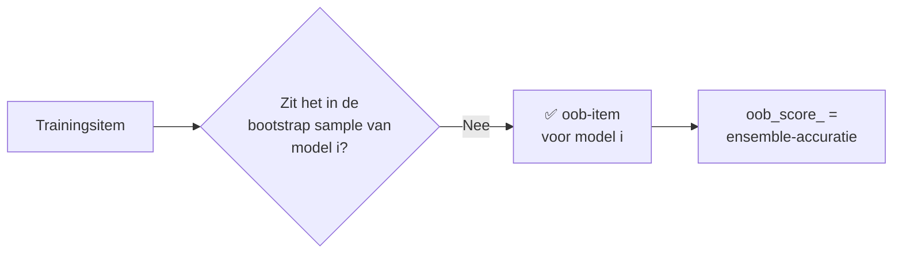

---

## Bagging in sklearn

```python
from sklearn.ensemble import BaggingClassifier
from sklearn.tree import DecisionTreeClassifier

bag_clf = BaggingClassifier(
    DecisionTreeClassifier(),   # base estimator
    n_estimators=500,           # aantal bomen
    max_samples=100,            # int: aantal items, float <1: proportie
    oob_score=True,             # bereken de oob-score
    n_jobs=-1,                  # gebruik alle CPU-cores (parallel!)
    random_state=42
)
bag_clf.fit(X_train, y_train)
bag_clf.oob_score_              # evaluatie zonder aparte validatieset
```

- **Pasting:** zelfde syntax, maar met `bootstrap=False`
- `max_samples` is *overloaded*: `int` = absoluut aantal items, `float` (0–1) = proportie van de trainingsset

---

## Bagging — Random Forest

- Een **random forest** is de specifieke benaming voor de ensemblemethode met allemaal **Decision Trees** erin
- Verschil met een gewone BaggingClassifier: elke boom zoekt bij elke split **niet** de beste feature, maar beperkt zich tot een **random selectie van features** (vaak $\sqrt{n_{\text{features}}}$)
  - → meer variatie tussen bomen
  - → iets meer bias, maar **minder overfitting** ✅

---

## Random Forest

```python
from sklearn.ensemble import RandomForestClassifier

rnd_clf = RandomForestClassifier(n_estimators=500, max_leaf_nodes=16,
                                 n_jobs=-1, random_state=42)
rnd_clf.fit(X_train, y_train)
```

> Dit gedrag kan je ook afdwingen met een `BaggingClassifier(DecisionTreeClassifier(max_features="sqrt"))` — bij een RandomForest is het ingebakken.


---

<!-- _class: interest-slide -->

## Random Forests — historische noot

- **Amit & Geman (1997)** — idee van **random feature-selectie** bij het zoeken naar splits ("shape quantization")
  - 📄 [doi.org/10.1162/neco.1997.9.7.1545](https://doi.org/10.1162/neco.1997.9.7.1545)
- **Breiman (2001)** — *Random Forests*: paper die bagging + random feature-subsets combineerde
  - 📄 [doi.org/10.1023/A:1010933404324](https://doi.org/10.1023/A:1010933404324)
- **Toepassingen vandaag:** kredietscoring & fraude-detectie (financiën), genoom-analyse & medische diagnose, satellietbeeldclassificatie (landgebruik), zoekmachines en ranking

---

## Boosting

- Boosting traint de onderliggende modellen **sequentieel**: de output van 1 model is input voor het volgende
- Boosting is dus **niet parallelliseerbaar**, in tegenstelling tot bagging

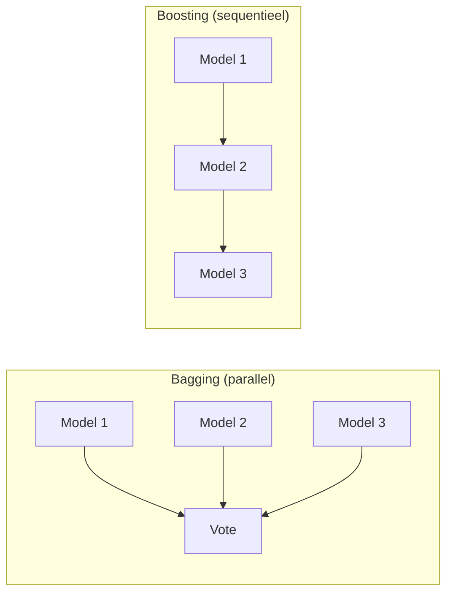

---

## Boosting

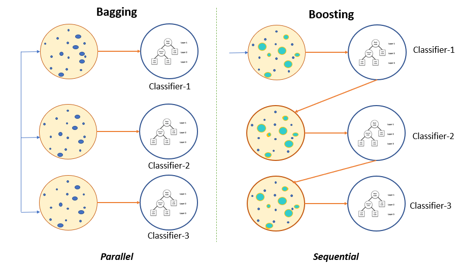

---

## AdaBoost

- Voor datasets die **veel ruis of uitschieters** hebben
- De **slecht geclassificeerde items** krijgen bij de volgende classifier **meer gewicht**, zodat het volgende model daar meer aandacht aan besteedt

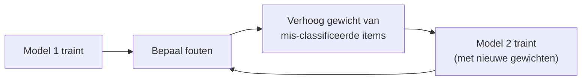
---
## AdaBoost achter de schermen
- Elke predictor krijgt ook een gewicht $\alpha_j$ evenredig met zijn kwaliteit:

$$ r_j = \frac{\sum_{i:\,\hat{y}_j^{(i)} \neq y^{(i)}} w^{(i)}}{\sum_{i=1}^{m} w^{(i)}}, \qquad \alpha_j = \eta \, \ln\frac{1-r_j}{r_j} $$

- $r_j$ = gewogen foutenratio, $\eta$ = learning rate
- `learning_rate` laag → langzamer maar beter (minder overfitting)

---

## AdaBoost in sklearn

```python
from sklearn.ensemble import AdaBoostClassifier

ada_clf = AdaBoostClassifier(
    DecisionTreeClassifier(max_depth=1),  # 'decision stump' = weak learner
    n_estimators=30,
    learning_rate=0.5,
    random_state=42
)
ada_clf.fit(X_train, y_train)
```

---

## Adaboost - invloed learning rate parameter

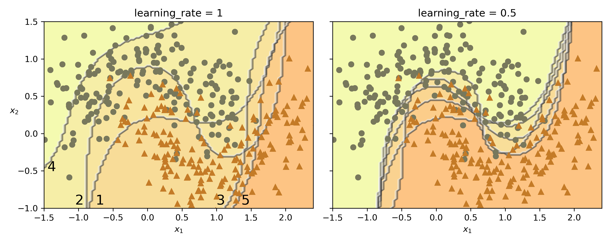

---

## Gradient Boosting

- Elke volgende predictor probeert de **fout (residu) van de vorige** te voorspellen
- De eindvoorspelling is de **som van alle predictors**:

$$ \hat{y} = h_1(x) + h_2(x) + \dots + h_m(x) $$

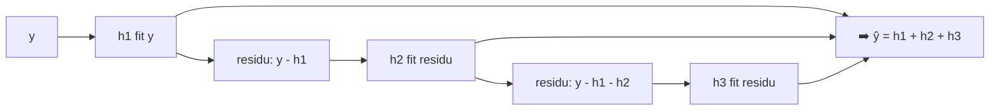

---

## Gradient Boosting

- XGBoost is hiervan een standaardimplementatie (apart te installeren)

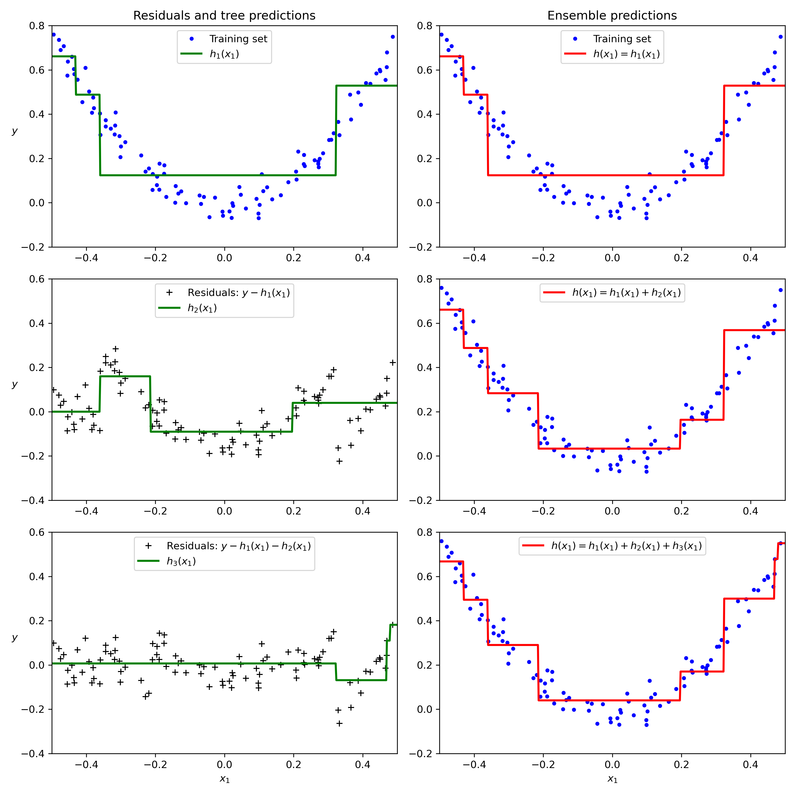

---

## Gradient Boosting in sklearn

```python
from sklearn.ensemble import GradientBoostingRegressor

gbrt = GradientBoostingRegressor(
    max_depth=2,        # diepte van elke boom
    n_estimators=3,     # aantal bomen
    learning_rate=1.0,  # hoe hard elke boom meetelt ('shrinkage')
    random_state=42
)
gbrt.fit(X, y)
```

- **Learning rate** bepaalt hoe hard elke boom meetelt: lager = trager proces, maar minder kans op overfitting (*shrinkage*)
- **Early stopping:** te veel bomen → overfitting. Stop wanneer de validatie-error begint te stijgen (XGBoost heeft dit ingebouwd via `early_stopping_rounds`)

---

## Stacking

- Bij stacking laat je een **finale model** (de **blender**) slim de andere modellen **samenvoegen**
- De blender wordt getraind op de voorspellingen van de onderliggende modellen (via cross-validatie)
- Nb: dit begint al sterk op een **Neural Net** te lijken

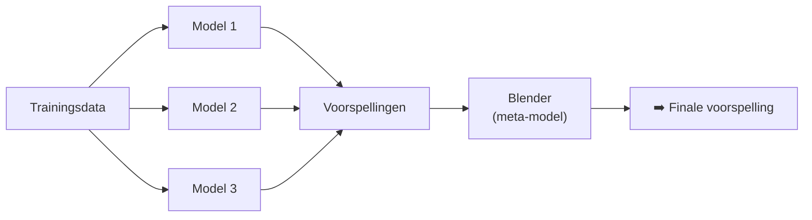

---
## Stacking

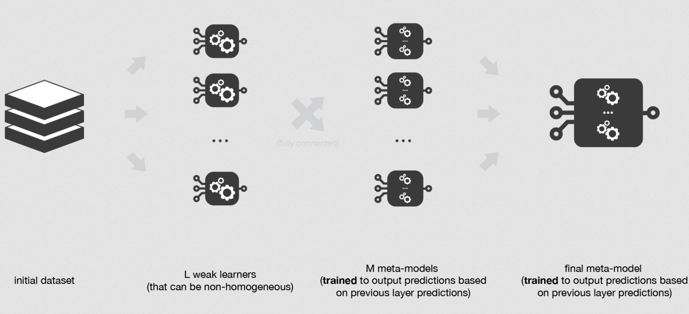

---

## Stacking in sklearn

```python
from sklearn.ensemble import StackingClassifier

stacking_clf = StackingClassifier(
    estimators=[
        ('lr', LogisticRegression(random_state=42)),
        ('rf', RandomForestClassifier(random_state=42)),
        ('svc', SVC(probability=True, random_state=42))  # probability=True voor soft voting
    ],
    final_estimator=RandomForestClassifier(random_state=43),  # de 'blender'
    cv=5  # aantal cross-validatie folds
)
stacking_clf.fit(X_train, y_train)
```

---
<!-- _class: red-bg -->
## Samenvatten

---

## Beste praktijken (Week 3)

- Een **losse decision tree** overfit snel → beperk met `max_depth`, `min_samples_leaf`, ...
- **Bagging / Random Forest:** parallel trainen van bomen op random subsets → minder variantie
  - random forest: extra randomisatie via **random feature-subsets** per split
  - evalueer via **oob_score_** — geen aparte validatieset nodig
- **Boosting:** sequentieel, elk model corrigeert de vorige (niet paralleliseerbaar)
  - `learning_rate` laag = *shrinkage* = minder overfitting
- **Stacking:** laat een blender de modellen combineren

---

## Kernpunten

- Gini impurity: $G_i = 1 - \sum_k p_{i,k}^2$ — CART minimaliseert $J(k, t_k)$ via een greedy search
- **Bagging** = bootstrap + aggregatie; **pasting** = zonder teruglegging; **oob** = gratis evaluatie (geen extra data nodig voor evaluatie)
- **Random Forest** = bagging van decision trees + random feature-subsets per split
- **Boosting**: AdaBoost (herweging van moeilijke items) vs Gradient Boosting (fit residuen, som van predictors) vs XGBoost (snelle, geoptimaliseerde implementatie)
- **Stacking**: een meta-model ('blender') leert de ensembleleden combineren

---

## Om af te sluiten

- <https://app.wooclap.com/LPFUTJ?from=status-bar>

---